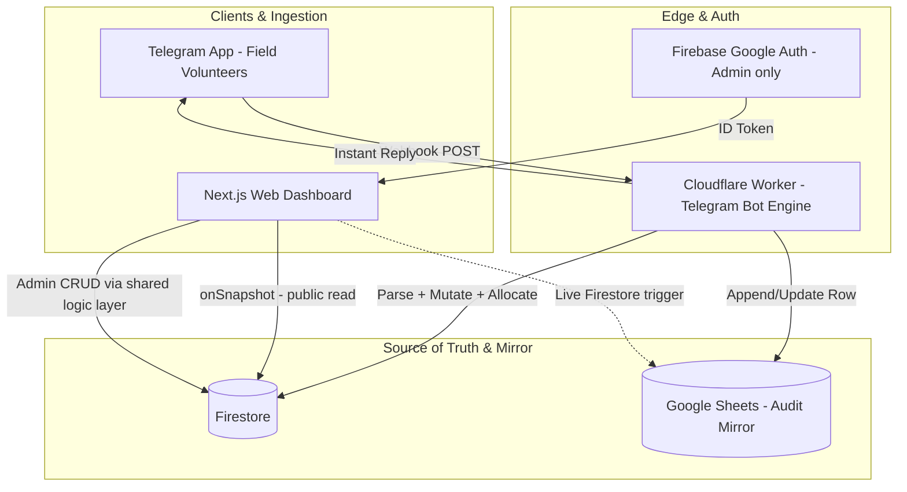
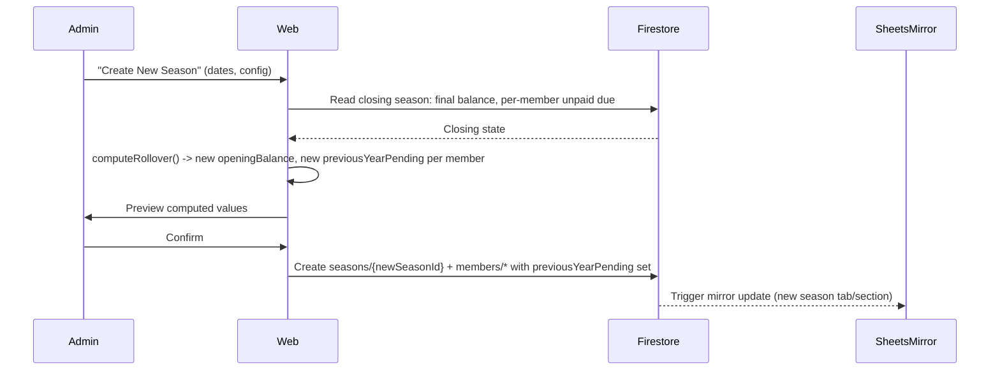

# Architecture.md — System Architecture

## 1. Overview

Event-driven, multi-platform system with **one single source of truth** (Firestore), edge compute for instant messaging (Cloudflare Workers), and a human-readable mirror (Google Sheets). The web dashboard and the Telegram bot are two independent clients of the same backend logic — they must never implement business rules separately (see `Agent-rules.md` §2).



## 2. Technology Stack

| Layer | Technology | Why |
| :--- | :--- | :--- |
| Web frontend | Next.js / React + Tailwind CSS | SSR for fast first paint, responsive tables/cards |
| Realtime database | Google Cloud Firestore | `onSnapshot` reactivity, document-level transactions |
| Bot runtime | Cloudflare Workers (V8 edge) | Global deploy, sub-50ms cold start, instant field replies |
| Audit/backup mirror | Google Sheets API | Non-technical readable ledger for committee/auditors |
| Auth | Firebase Google Authentication | Public read / Admin-only write model |
| Shared business logic | Isolated module (see §4), imported by both the Worker and the Next.js API routes | Prevents logic drift between bot and web |

## 3. Firestore Data Model

```
firestore-root
├── seasons/{seasonId}                      e.g. "2026-2027"
│   ├── name, startDate, endDate
│   ├── openingBalance: number
│   ├── isActive: boolean
│   │
│   ├── members/{memberId}
│   │   ├── name: string
│   │   ├── previousYearPending: number
│   │   ├── isHonorary: boolean
│   │   ├── isPaused: boolean
│   │   ├── monthlyOverrides: { "YYYY-MM": number }
│   │   └── payments: { "YYYY-MM": number }        // cumulative paid per month
│   │
│   ├── buildings/{buildingId}                     e.g. "A_WING"
│   │   ├── name, code
│   │   └── floors/{floorId}
│   │       ├── floorName                          e.g. "3F", "GR"
│   │       └── flats/{flatNo}
│   │           ├── residentName
│   │           ├── amountPaid
│   │           ├── isPaid
│   │           └── paymentMode: "ONLINE" | "OFFLINE"
│   │
│   ├── transactions/{txnId}                       e.g. "TXN-00142"
│   │   ├── sequenceNumber: number
│   │   ├── timestamp
│   │   ├── type: "MEMBER" | "BUILDING" | "CHANDA" | "EXPENSE"
│   │   ├── amount: number
│   │   ├── mode: "ONLINE" | "OFFLINE"
│   │   ├── status: "ACTIVE" | "REVERSED"
│   │   ├── description
│   │   └── metadata: { memberId?, buildingCode?, flatNo? }
│   │
│   └── audit_logs/{logId}
│       ├── txnId
│       ├── action: "CREATE" | "UPDATE" | "UNDO"
│       ├── previousValue, newValue
│       ├── performedBy: "TelegramBot" | "Admin:<name>"
│       └── timestamp
│
└── globalConfig/settings
    ├── authorizedTelegramUserIds: string[]
    └── defaultMonthlyQuota: number
```

**Non-negotiable modeling rules:**
- A transaction document is **mutable for its current value** but **immutable for its identity and history** — see §6.
- All monetary totals are **derived**, never stored as a separately-maintained running counter that can drift. Compute from `transactions` where `status == "ACTIVE"` (cached/denormalized aggregates are allowed only as a performance layer that is rebuildable from the transaction log at any time).
- `sequenceNumber` is the human-facing short code used in Telegram (`3 undo`) — it is permanent and never reused, even after `undo`.

## 4. Shared Business Logic Layer

To satisfy PRD §5 (all rules must behave identically regardless of entry point), the following logic must live in **one importable module**, consumed by both the Cloudflare Worker and the Next.js backend (API routes / server actions):

- `resolveEntryType(rawMessage)` — classifies a freeform Telegram message into MEMBER / BUILDING / CHANDA / EXPENSE, per the routing tree in §5.
- `computeMemberDue(member, season, liveMonth)` — implements the Live Month Rule (PRD §5.2) and the Previous-Year + Current-Season split (PRD §5.5).
- `allocatePayment(member, amount, season)` — implements the Waterfall (PRD §5.4): previous-year pending → current live due → next active unblocked month.
- `reverseTransaction(txnId)` — flips status, writes an audit log, and returns the recomputation instructions for all dependent aggregates.
- `rolloverSeason(closingSeasonId, newSeasonConfig)` — computes new `openingBalance` and new `previousYearPending` per member from the closing season's final state.

**Rule:** if a piece of logic decides "how much is due" or "where a payment goes," it lives here — not duplicated inline in the Worker's message handler or a React component. See `Agent-rules.md` §2.

## 5. Telegram Bot: Message Routing State Machine

```
Incoming Telegram message
   │
   ├── Starts with "/" ? ──Yes──> Slash command handler (/1–/9)
   │
   └── No
        │
        ├── Starts with "-" ? ──Yes──> EXPENSE entry
        │                              parse: - <amount> <item> [O]
        │
        └── No
             │
             ├── Token count / shape matches BuildingCode+FlatNo pattern?
             │        (Name BuildingCode FlatNo Amount [O])
             │   ├── Yes, and BuildingCode+FlatNo resolve in Firestore
             │   │        → BUILDING FLAT COLLECTION
             │   └── Yes, but BuildingCode+FlatNo do NOT resolve
             │            → reply with a clear "unknown wing/flat" error (do not guess)
             │
             └── Else: (Name Amount [O])
                      │
                      ├── Name matches a registered member (case-insensitive)?
                      │   ├── Yes → MEMBER CONTRIBUTION → allocatePayment()
                      │   └── No  → GENERAL CHANDA entry
                      │
                      └── (single-token message, no amount) → treat as MEMBER LOOKUP,
                          reply with that member's paid total + current due
```

**The `O` rule:** `O` is only treated as the online-mode flag when it is the **final standalone whitespace-delimited token** of the message. `- 500 Oil` must resolve to an offline ₹500 expense named "Oil", never to an online-flagged expense.

### Slash Command Contract

| Command | Behavior |
| :--- | :--- |
| `/1` | Finance Summary: total net balance, online balance, offline balance, total expenses. |
| `/2` | Member Dues List, sorted descending by amount due. |
| `/3` | Offline Income List with transaction codes. |
| `/4` | Offline Expense List with transaction codes. |
| `/5` | Online Income List with transaction codes. |
| `/6` | Online Expense List with transaction codes. |
| `/7` | Combined Income (online + offline). |
| `/8` | Combined Expense (online + offline). |
| `/9` | Help / command menu — plain text, minimal emoji. |
| `<id> undo` | Reverses the transaction with that sequence number, everywhere. |

## 6. Reversal & Correction Model (Audit-Preserving Edit)

Naive "add an offsetting row" designs double-count history and are explicitly rejected (see `Product-explanation.md` §6). The locked design:

1. The transaction document (`TXN-105`) is updated **in place** — its `amount` field reflects the current/corrected value.
2. An `audit_logs` entry is appended: `{ txnId, action: "UPDATE", previousValue, newValue, performedBy, timestamp }`.
3. Google Sheets: the `Current_Transactions` row for `TXN-105` is updated to the new value; a separate `Audit_Correction_Logs` sheet gets a new row for the change.
4. All aggregate calculations (season totals, member dues, wing totals) query **only** the current field value of `ACTIVE` transactions — they never sum "original + correction" as two separate line items.
5. `undo` is a special case of this same pattern: `status` flips `ACTIVE → REVERSED`; nothing is deleted; all totals recompute by excluding non-`ACTIVE` rows.

## 7. Google Sheets Mirror Schema

**Sheet 1 — `Current_Transactions`** (always reflects current active state):
`Txn Code | Timestamp | Category | Entity/Resident | Wing/Flat | Amount (₹) | Mode | Status`

**Sheet 2 — `Audit_Correction_Logs`** (append-only history):
`Log ID | Txn Code | Timestamp | Performed By | Action | Old Value | New Value | Reason/Notes`

Sheets are written to **after** the Firestore write succeeds (Firestore is authoritative; Sheets failure must not block or roll back a Firestore mutation — it should instead flag a sync-drift warning surfaced in the Admin panel per `PHASES.md` Phase 5).

## 8. Season Rollover Data Flow



## 9. Security Model

- **Firestore Security Rules:** `read: true` on all season/member/building/transaction/audit collections (public transparency, per PRD §4). `write: false` by default; write allowed only for requests carrying a verified Admin custom claim, plus a dedicated service-account identity used exclusively by the Cloudflare Worker (never a shared/static API key embedded client-side).
- **Telegram Bot authorization:** the Worker checks the incoming Telegram `chat_id`/`user_id` against `globalConfig.authorizedTelegramUserIds` before processing any mutating command; unauthorized senders get no data-changing response (read-only slash commands may be considered separately, but default posture is deny-by-default for anyone not on the allow-list).
- **Google Auth (Admin):** Firebase Google Sign-In; the Admin's UID must be present in an allow-list (custom claim or a `globalConfig.adminUids` list checked server-side) — a Google account alone is not sufficient.
- **Secrets:** Google Sheets service account credentials and the Telegram bot token live only in Cloudflare Worker environment secrets / Firebase server-side config — never in client bundle, never in a public repo.

## 10. Deployment Topology

- **Web app:** deployed on a platform supporting Next.js SSR (e.g. Vercel or Firebase Hosting + Cloud Functions/Run for SSR).
- **Telegram bot:** Cloudflare Worker, webhook URL registered with Telegram Bot API.
- **Database:** Firestore (single project, single region choice fixed at provisioning — do not multi-region shard for this scale).
- **Sheets:** one Google Sheet per... decision point: either one sheet with a tab per season, or one long-running sheet with a `Season` column — recommend **one tab per season** to keep `Current_Transactions` fast to scan for committee members, with a lifetime `All_Seasons_Archive` tab generated on rollover.
