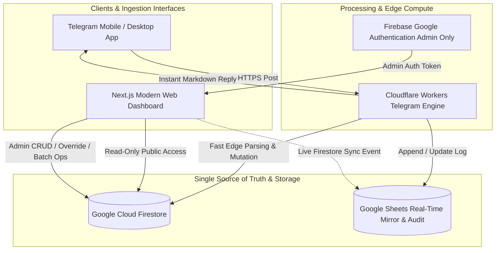

# 🕉️ Ganpati Mandal Financial & Operations Management System
## Complete Product Specification, Technical Architecture & Operational Blueprint

---

## 📌 1. Executive Summary & Vision

The **Ganpati Mandal Management System** is a unified, real-time financial ledger, member contribution tracker, building collection monitor, and audit system designed specifically for the operational challenges of cultural festival mandals (*Sarvajanik Ganeshotsav Mandals*).

### The Core Problem Statement
Festivals like Ganesh Chaturthi operate under intense, high-velocity cash and digital inflows and outflows:
1. **Personal vs. Mandal Money Entanglement**: The Mandal Finance Head ("Khajanchi") frequently shares their personal UPI QR code for festival donations on the ground. Personal savings and Mandal donations get co-mingled in a single bank account, making it stressful and tedious to calculate how much personal money remains untouched.
2. **Fragmented Inflow Channels**: Funds come from multiple distinct streams:
   - Monthly regular member contributions (with custom amounts per member, variable duration seasons, and blocked non-active months).
   - Door-to-door building and flat collections mapped to specific wings, floors, and room numbers.
   - Voluntary extra *chanda* (donations) from local shops, businesses, and residents.
3. **High-Speed On-Ground Data Entry**: Volunteers collecting funds in the field cannot navigate complex enterprise software. They need an ultra-fast, zero-friction interface—specifically a **Telegram Bot** capable of executing immediate ledger entries using shorthand messages like `Rahul 200 O` or `Rahul A 001 500`.
4. **Year-Over-Year Continuity & Multi-Season Rollover**: Ganesh Chaturthi shifts dates annually based on the Hindu calendar (e.g., September 14 in 2026, October or November in other years). Festival seasons are not standard 12-month calendar cycles. When rolling over to a new season, **previous year closing balances must become opening balances**, and **unpaid member dues from past seasons must carry over** into total dues without erasing historical records.
5. **Real-Time Reversals & Complete Auditability**: When cash is returned, goods refunded, or erroneous entries made, the system must allow a simple command (e.g., `3 undo`) that recalculates balances instantly across Firestore, the web dashboard, and Google Sheets without breaking audit integrity.

---

## 🏗️ 2. High-Level Architecture & Technology Stack

The solution is architected as an event-driven, reactive multi-platform ecosystem with a **single source of truth** in Firebase Firestore, edge processing for instant messaging, and a mirror audit sheet in Google Sheets.



### Technology Stack Justification
| Component | Technology | Rationale |
| :--- | :--- | :--- |
| **Frontend Web App** | **Next.js / React + Vanilla CSS / Tailwind** | Ultra-fast initial load times, server-side rendering for instant page paints, fluid responsive tables and elevation matrices on both mobile and desktop. |
| **Primary Database** | **Google Cloud Firestore (Firebase)** | Real-time reactive listeners (`onSnapshot`), sub-second synchronization between Telegram bot actions and web display, robust document-level ACID transactions. |
| **Telegram Bot Engine** | **Cloudflare Workers (V8 Edge runtime)** | Global serverless deployment, sub-50ms cold starts, instantaneous bot responses directly to field volunteers. |
| **Audit & Backup Vault** | **Google Sheets API** | Zero-maintenance, non-technical ledger readable by committee elders and auditors; serves as exportable proof when presenting accounts. |
| **Security & Auth** | **Firebase Google Auth** | Hybrid public read-only model (anyone can inspect finances for complete community transparency) with strictly guarded Admin write permissions. |

---

## 🏛️ 3. Core Modules & Application Structure

The web application is structured around a streamlined, responsive interface with a persistent bottom navigation bar on mobile and a top header on desktop:

```
┌────────────────────────────────────────────────────────────────────────┐
│                        GANPATI MANDAL PORTAL                           │
├─────────────┬─────────────┬─────────────┬─────────────┬────────────────┤
│ 👥 Members  │ 🏢 Building │  💰 Income  │ 📉 Expense  │ ⚙️ Admin Panel │
└─────────────┴─────────────┴─────────────┴─────────────┴────────────────┘
```

---

### Module 1: 👥 Members Management & Ledger Tab

The Members tab tracks recurring monthly contributions from Mandal members over an active festival season.

```
┌────────────────────────────────────────────────────────────────────────┐
│  Collected (YTD) : ₹5,775  │  Total Dues : ₹3,075  │  Prev Bal : ₹6,500 │
├────────────────────────────────────────────────────────────────────────┤
│  Track up to: [ 2026-09 ]                          Sort by: [ Due (Desc) ]
├────────────────────────────────────────────────────────────────────────┤
│ Member Name │ Sep 25 │ Oct 25 │ Nov 25 │ Dec-May │ Jun 26 │ Total │ Status │
├─────────────┼────────┼────────┼────────┼─────────┼────────┼───────┼────────┤
│ PIYUSH      │  ₹100  │  ₹100  │  ₹100  │   🚫    │  ₹191  │ ₹491  │ ₹659 Due│
│ ARYAN       │  ₹100  │  ₹100  │  ₹100  │   🚫    │  ₹200  │ ₹810  │ ₹340 Due│
│ RONIK       │   --   │   --   │   --   │   🚫    │   --   │  ₹0   │ Honorary│
└─────────────┴────────┴────────┴────────┴─────────┴────────┴───────┴────────┘
```

#### Key Capabilities & Rules
1. **Summary Metrics**:
   - **Collected (YTD)**: Total member contributions collected in the active season.
   - **Total Dues**: Sum of all outstanding dues across all active members up to the tracked month.
   - **Previous Year Balance**: Opening surplus carried over from the previous season.
2. **Excel-Style Desktop Matrix & Mobile Card View**:
   - **Desktop**: A dense, horizontal scroll table where rows represent members and columns represent active months of the season.
   - **Mobile**: Responsive expandable cards showing member name, paid total, current dues badge, and an expandable monthly breakdown.
3. **Live Month Due Limitation (The Golden Rule)**:
   - Dues are calculated **strictly up to the current live/tracked month** (e.g., if today is September 2026, dues are evaluated only for months up to September 2026).
   - Even if the Admin configures October 2026 or November 2026 with an expected ₹200 fee, that future amount is **never** added to the member's current due until that month becomes active.
4. **Flexible Month Duration & Non-12-Month Cycles**:
   - Festival cycles follow the lunar calendar. A season can stretch 10 months, 12 months, or 14 months. The system handles arbitrary month counts seamlessly.
5. **Month Blocking & Exemption Matrix**:
   - **Global Month Block**: Admin can mark entire months (e.g., post-Diwali lean periods: December through May) as blocked (`🚫`). When blocked, expected dues for all members during that month are ₹0.
   - **Individual Overrides & Exemptions**: Specific members can have individual custom amounts (e.g., students or children paying ₹100 instead of standard ₹200) or be flagged as **Honorary Members** (no monthly dues required).
6. **Payment Carry-Forward Engine**:
   - If a member owes ₹150 for September and pays ₹200, the extra ₹50 is not left floating; it automatically cascades forward into the **next active, unblocked month's** target balance.

---

### Module 2: 🏢 Buildings & Flat Elevation Ledger Tab

For door-to-door building collection drives, the system provides a spatial, architectural view of every wing, floor, and flat.

```
┌────────────────────────────────────────────────────────────────────────┐
│ Total Collection: ₹5,750  │  Collected Flats: 24  │  Pending Flats: 24 │
├────────────────────────────────────────────────────────────────────────┤
│ [ A Wing (₹4,000) ]     [ B Wing (₹850) ★ ]      [ B2 Wing (₹900) ]    │
│ 16 Flats | ✓7  ✗9       16 Flats | ✓8  ✗8        16 Flats | ✓9  ✗7     │
├────────────────────────────────────────────────────────────────────────┤
│ 🏢 B WING ELEVATION (16 Flats Total)                                    │
│ ┌────┬───────────────────────────────────────────────────────────────┐ │
│ │ 3F │ [301 Ananya ₹200] [302 Phoolchand ₹50] [303 - Pending] [304..] │ │
│ │ 2F │ [201 - Pending]   [202 Maharaj ₹100]   [203 - Pending] [204..] │ │
│ │ 1F │ [101 None ₹50]    [102 - Pending]      [103 - Pending] [104..] │ │
│ │ GR │ [001 - Pending]   [002 Dimpu ₹100]     [003 Mane ₹100] [004..] │ │
│ └────┴───────────────────────────────────────────────────────────────┘ │
└────────────────────────────────────────────────────────────────────────┘
```

#### Key Capabilities & Rules
1. **Top Summary Gauges**:
   - Aggregated collection across all buildings.
   - Total number of registered flats.
   - Split count: Flats that have contributed vs. flats with pending contributions.
2. **Wing Cards with Progress Indicators**:
   - Displays Wing Name, Short Code (e.g., `A`, `B`, `B2`), Total Collection, Total Flats, Count of Paid Flats (`✓`), Count of Pending Flats (`✗`), and a progress gradient bar.
3. **Architectural Elevation Breakdown**:
   - Selecting a wing opens its floor-by-floor elevation grid from top floor down to Ground floor:
     - `3F` → Third Floor
     - `2F` → Second Floor
     - `1F` → First Floor
     - `GR` → Ground Floor
   - Each floor lists all flats horizontally with their unit number, payer name, and current status.
4. **Visual State Cues**:
   - **Paid**: Emerald green background, resident name, and green amount badge (e.g., `₹100`, `₹200`).
   - **Pending**: Clean neutral/white card with gray `Pending` indicator.
5. **Admin Structure Management**:
   - Admin defines the building hierarchy: Wing Name, unique parsing code, floor names, and flat numbers with their respective codes.

---

### Module 3: 💰 Extra Income & General Chanda Tab

Tracks all non-member, non-flat collections: voluntary chanda from shopkeepers, passersby, neighborhood patrons, and general donors.

```
┌────────────────────────────────────────────────────────────────────────┐
│ Total Extra: ₹2,271   │   Total Entries: 16 Logs   │ [ Split View: ON ]│
├───────────────────────┴────────────────────────────┴───────────────────┤
│ ➕ New Entry Form:                                                     │
│ Name / Shop: [ Sumit Kirana         ]  Amount (₹): [ 101 ]             │
│ Mode: (•) Cash (Offline)  ( ) Online   [ Add to Ledger ]               │
├────────────────────────────────────────────────────────────────────────┤
│ 📋 Recent Logs (Latest → Oldest):                                      │
│ • Ronik Patel        Collected: ₹200 (Offline)       #16 [ 🗑️ Delete ] │
│ • Tailor             Collected: ₹200 (Online)        #15 [ 🗑️ Delete ] │
│ • Laundry            Collected: ₹100 (Offline)       #14 [ 🗑️ Delete ] │
│ • Shawant            Collected: ₹500 (Online)        #13 [ 🗑️ Delete ] │
└────────────────────────────────────────────────────────────────────────┘
```

#### Key Capabilities & Rules
1. **Isolated Revenue Stream**: Keeps general community donations separate from member monthly pledges and flat-rate society collections.
2. **Split View Mode**:
   - **Unified View**: Shows all entries chronologically.
   - **Split View**: Partitions entries into two dedicated columns:
     - **Offline Sub-ledger**: Offline total, entry count, and cash receipts.
     - **Online Sub-ledger**: Online total, entry count, and digital transaction receipts.
3. **Reverse Chronological Logs**: Logs are sorted strictly with latest entries at the top, showing donor name, timestamp, amount, payment mode, and unique transaction code.
4. **Admin Direct Add & Inline Delete**: Admin can add entries directly through the web form or delete/undo any entry.

---

### Module 4: 📉 Expenses & Outflow Tracker Tab

Tracks all Mandal expenditures for festival preparations, pooja supplies, decorations, sound, lighting, pandal materials, and food offerings.

```
┌────────────────────────────────────────────────────────────────────────┐
│ Total Kharcha: ₹1,600  │  Total Logs: 17 Items  │ [ Split View: ON ]   │
├────────────────────────────────────────────────────────────────────────┤
│ 📋 Expense Stream (Latest → Oldest):                                   │
│ • Female Plug       08/09/2026, 20:06   -₹20   (Offline)  #32 [Edit]   │
│ • Glitter           07/09/2026, 22:16   -₹10   (Offline)  #31 [Edit]   │
│ • Black Kapda       02/09/2026, 19:16   -₹100  (Online)   #30 [Edit]   │
│ • Strip Light       31/08/2026, 22:52   -₹191  (Online)   #29 [Edit]   │
│ • Cotton            15/08/2026, 22:33   -₹300  (Offline)  #28 [Edit]   │
└────────────────────────────────────────────────────────────────────────┘
```

#### Key Capabilities & Rules
1. **Instant Outflow Recording**: Captures item description, timestamp, amount (displayed as `-₹X`), payment mode (Cash vs. UPI), and transaction sequence ID.
2. **Split View Mode**:
   - Enables instant comparison of how much cash was spent out of pocket vs. how much was disbursed via digital UPI transfers.
3. **Refund & Return Handling**:
   - When defective materials are returned to vendors (e.g., returned wire or lights), the admin can trigger a reversal (`<id> undo`), which removes the expense from the total and replenishes the balance automatically.

---

### Module 5: ⚙️ Admin Control Center & Season Lifecycle Engine

The Admin panel is the nervous system of the platform, locked behind Google Authentication.

```
┌────────────────────────────────────────────────────────────────────────┐
│ ⚙️ ADMIN CONTROL CENTER                                               │
├────────────────────────────────────────────────────────────────────────┤
│ 🟢 System Sync Status: Telegram (OK) | Firestore (OK) | Sheets (OK)   │
├────────────────────────────────────────────────────────────────────────┤
│ [ Active Season: 2026-2027 ]        [ ➕ Create New Season / Batch ]   │
│ Dates: 15-Aug-2026 to 25-Sep-2027   Opening Surplus: ₹6,500            │
├────────────────────────────────────────────────────────────────────────┤
│ Quick Admin Actions:                                                   │
│ [ 👥 Member Settings ] [ 🏢 Wing Setup ] [ 🚫 Block Month ] [ 📥 Export]│
└────────────────────────────────────────────────────────────────────────┘
```

#### Key Capabilities & Rules
1. **Authentication & Session Security**:
   - Public visitors have read-only transparency.
   - Only authenticated Admin accounts can mutate Firestore documents, add records, or manage system configuration.
2. **Season & Batch Rollover Lifecycle**:
   - Supports creating named seasons (e.g., `2025-2026`, `2026-2027`) with custom calendar start and end dates.
   - **Historical Preservation**: Past seasons are permanently archived. Switching seasons allows viewing full past year ledgers.
   - **Balance Roll-Forward**:
     $$\text{New Season Opening Balance} = \text{Previous Season Closing Balance}$$
   - **Dues Roll-Forward**:
     $$\text{Total Member Due} = \text{Previous Season Unpaid Due} + \text{Current Season Active Due}$$
3. **Multi-Tier Payment Allocation Waterfall**:
   When a member makes a payment in the new season, funds are allocated in strict priority:
   ```
   Step 1: Clear Previous Year Pending Recovery
           │ (Reduces Old Season Due & New Season Previous Pending)
           ▼
   Step 2: Clear Current Active Month Due
           │ (Reduces Current Season Live Due)
           ▼
   Step 3: Carry-forward Surplus to Next Active Month
   ```
4. **Member Lifecycle Controls**:
   - Add new members, modify names, adjust expected monthly quotas.
   - **Pause Member**: Temporarily freeze a member's dues accrual without deleting their historical record.
5. **Building & Flat Hierarchy Management**:
   - Add/edit wings, custom parsing codes, floor assignments, and flat configurations.
6. **Data Resilience & Backup**:
   - One-click full Firestore export (JSON/CSV).
   - Bi-directional sync verification with Google Sheets.

---

## 🤖 4. Telegram Bot Specification & Command Interface

The Telegram Bot is hosted on Cloudflare Workers for edge execution. It is the primary data ingestion tool for field workers collecting donations.

```
                      TELEGRAM MESSAGE INGESTION
                                   │
                     Is it a Slash Command?
                     ├── Yes: Handle (/1 to /9, etc.)
                     └── No:  Parse Transaction Syntax
                                   │
              ┌────────────────────┴────────────────────┐
       Starts with '-' ?                         Does it have
       (e.g., - 500 Lights)                     Building Code?
              │                                  (e.g., Rahul A 001 500)
              ▼                                         │
        EXPENSE RECORD                           ┌──────┴──────┐
                                                Yes            No
                                                 │              │
                                                 ▼              ▼
                                           BUILDING FLAT   Check Member
                                             COLLECTION     Match in DB
                                                                │
                                                         ┌──────┴──────┐
                                                       Match        No Match
                                                         │              │
                                                         ▼              ▼
                                                      MEMBER         EXTRA
                                                     CONTRIBUTION    CHANDA
```

### Slash Commands Reference Table
| Command | Name | Action & Output |
| :--- | :--- | :--- |
| `/1` | **Finance Summary** | Returns clean summary: Total Net Balance, Online Balance, Cash (Offline) Balance, Total Expenses. |
| `/2` | **Member Dues List** | Returns sorted list of all members with pending dues (highest due on top, descending order). |
| `/3` | **Offline Income List** | Returns list of all offline/cash donations with unique transaction IDs (`#1`, `#2`...). |
| `/4` | **Offline Expense List** | Returns list of all cash expenditures with transaction IDs. |
| `/5` | **Online Income List** | Returns list of all online/UPI donations with transaction IDs. |
| `/6` | **Online Expense List** | Returns list of all online/UPI expenditures with transaction IDs. |
| `/7` | **Combined Income** | Returns complete income ledger (Online + Offline) with transaction IDs. |
| `/8` | **Combined Expense** | Returns complete expense ledger (Online + Offline) with transaction IDs. |
| `/9` | **Command Menu / Help** | Displays full reference guide with syntax rules and examples. |
| `<Name>` | **Member Quick Lookup** | Typing just a member's name (e.g., `Rahul`) returns their specific Paid Total & Current Dues. |
| `<ID> undo` | **Transaction Reversal** | Reverses transaction ID (e.g., `3 undo`), updating Firestore, web dashboard, and Google Sheets. |

### Field Data Entry Syntax
Field entries require no slash prefix—the bot automatically interprets natural shorthand tokens.

#### 1. Member Contribution Entry
- **Format**: `Name Amount [O]`
- **Examples**:
  - `Rahul 200` *(Records ₹200 offline cash payment for member Rahul)*
  - `Rahul 200 O` *(Records ₹200 online UPI payment for member Rahul)*
- **Routing**: Matches name case-insensitively against registered members. If found, applies payment to member ledger.

#### 2. General Community Chanda Entry
- **Format**: `Name Amount [O]`
- **Examples**:
  - `SumitKirana 101` *(Records ₹101 offline chanda)*
  - `RajuPatel 500 O` *(Records ₹500 online chanda)*
- **Routing**: If name does not match any registered member, automatically logs as General Chanda.

#### 3. Building & Flat Collection Entry
- **Format**: `Name BuildingCode FlatNo Amount [O]`
- **Examples**:
  - `Rahul A 001 500` *(Cash collection from Rahul, Wing A, Flat 001)*
  - `Ananya B 301 200 O` *(UPI collection from Ananya, Wing B, Flat 301)*
- **Routing**: Matches `BuildingCode` and `FlatNo`, attaches payment to the flat, updates wing elevation in real time.

#### 4. Expense Entry
- **Format**: `- Amount Item/Purpose [O]`
- **Examples**:
  - `- 500 Decoration` *(Cash expense of ₹500 for decoration)*
  - `- 191 StripLight O` *(Online UPI expense of ₹191 for strip lights)*
- **Routing**: Leading `-` directs record straight to the Expense Ledger.

> [!IMPORTANT]
> **The Online Indicator Rule**: The letter `O` must be provided as the **final standalone token** of the command to signify an online transaction. This prevents accidental triggers from items or names containing the letter 'O' (e.g., "- 500 Oil").

---

## 🔢 5. Financial Mathematics & Reconciliation Formulas

### 1. The Khajanchi Personal Account Separation Formula
Because the Finance Minister's personal UPI is used for digital collections:

$$\text{Net Mandal Online Pool} = \sum (\text{Online Inflows}) - \sum (\text{Online Expenses})$$

$$\text{Actual Personal Savings} = \text{Current Bank Balance} - \text{Net Mandal Online Pool}$$

This calculation gives the Finance Minister peace of mind, allowing them to verify their actual personal funds at any time.

### 2. Overall Mandal Fund Balance
$$\text{Total Festival Balance} = \text{Season Opening Balance} + \sum (\text{All Inflows}) - \sum (\text{All Expenses})$$

Where:
$$\sum (\text{All Inflows}) = \text{Member Payments} + \text{Building Collections} + \text{General Chanda}$$
$$\sum (\text{All Expenses}) = \text{Cash Expenses} + \text{Online Expenses}$$

### 3. Live Month Member Dues Calculation
For any given member $m$ at the current active tracking month $T$:

$$\text{Member Target Dues}(m, T) = \sum_{k=1}^{T} \text{Monthly Quota}(m, k) \quad \text{where month } k \text{ is not blocked}$$

$$\text{Current Season Dues}(m) = \max\left(0, \, \text{Member Target Dues}(m, T) - \text{Total Season Paid}(m)\right)$$

$$\text{Total Outstanding Dues}(m) = \text{Previous Year Pending}(m) + \text{Current Season Dues}(m)$$

### 4. Waterfall Payment Allocation Example
Suppose member **Piyush** has:
- Previous Year Pending: ₹200
- October 2026 Target: ₹100
- November 2026 Target: ₹100

| Action / Payment | Step 1: Prev Year Pending | Step 2: Oct 2026 Due | Step 3: Nov 2026 Due | Net Status |
| :--- | :--- | :--- | :--- | :--- |
| **Initial State** | ₹200 | ₹100 | Future (₹100) | ₹300 Total Due (₹200 Prev + ₹100 Live) |
| **Telegram: `Piyush 100`** | ₹100 (₹100 cleared) | ₹100 (Unchanged) | Future (₹100) | ₹200 Total Due (₹100 Prev + ₹100 Live) |
| **Telegram: `Piyush 150`** | ₹0 (₹100 cleared) | ₹50 (₹50 cleared) | Future (₹100) | ₹50 Total Due (₹0 Prev + ₹50 Live) |
| **Telegram: `Piyush 100`** | ₹0 (Cleared) | ₹0 (₹50 cleared) | Target ₹100 - ₹50 = ₹50 | ₹0 Current Due (₹50 carried to Nov) |

---

## 🔄 6. Reversal Engine & Audit Integrity

When a transaction is reversed using `<id> undo` or edited via the Web Admin Panel:

```
┌────────────────────────────────────────────────────────────────────────┐
│ Original Record: TXN-105 (-₹50 Expense for Tape)                       │
├────────────────────────────────────────────────────────────────────────┤
│ ACTION: Admin edits amount to ₹30                                      │
├────────────────────────────────────────────────────────────────────────┤
│ ❌ NAIVE APPROACH (Flawed):                                            │
│   Create a new correction row of -₹30 without linking.                 │
│   Total becomes -₹50 + -₹30 = -₹80 (INCORRECT!)                        │
├────────────────────────────────────────────────────────────────────────┤
│ ✅ MANDAL SYSTEM DESIGN (Audit Preserving):                            │
│   1. Document `TXN-105` remains active with updated value: -₹30.       │
│   2. An immutable event is written to `audit_logs`:                    │
│      { txnId: "TXN-105", oldVal: -50, newVal: -30, admin: "Rishi",   │
│        timestamp: "2026-09-09T15:30:00Z", action: "UPDATE" }         │
│   3. In Google Sheets:                                                 │
│      - `Transactions` sheet updates row TXN-105 to -₹30.               │
│      - `Audit_Logs` sheet appends the historical change record.        │
│   4. When `105 undo` is called:                                        │
│      - `status` set to "CANCELLED" / "REVERSED".                      │
│      - Calculation queries filter for `status == "ACTIVE"`.            │
│      - All season totals and opening balances dynamically recalculate.│
└────────────────────────────────────────────────────────────────────────┘
```

---

## 🗄️ 7. Database Schema Design (Firestore Document Model)

```
firestore-root
│
├── seasons/ (collection)
│   └── {seasonId}/ ("2026-2027")
│       ├── name: "2026-2027"
│       ├── startDate: Timestamp
│       ├── endDate: Timestamp
│       ├── openingBalance: 6500.00
│       ├── isActive: true
│       │
│       ├── members/ (sub-collection)
│       │   └── {memberId}/ ("piyush")
│       │       ├── name: "PIYUSH"
│       │       ├── previousYearPending: 200.00
│       │       ├── isHonorary: false
│       │       ├── isPaused: false
│       │       ├── monthlyOverrides: { "2026-10": 100 }
│       │       └── payments: { "2026-09": 100, "2026-10": 191 }
│       │
│       ├── buildings/ (sub-collection)
│       │   └── {buildingId}/ ("A_WING")
│       │       ├── name: "A Wing"
│       │       ├── code: "A"
│       │       └── floors/ (sub-collection)
│       │           └── {floorId}/ ("3F")
│       │               ├── floorName: "3F"
│       │               └── flats/ (sub-collection)
│       │                   └── {flatNo}/ ("301")
│       │                       ├── residentName: "Ananya"
│       │                       ├── amountPaid: 200.00
│       │                       ├── isPaid: true
│       │                       └── paymentMode: "ONLINE"
│       │
│       ├── transactions/ (sub-collection)
│       │   └── {txnId}/ ("TXN-00142")
│       │       ├── sequenceNumber: 142
│       │       ├── timestamp: Timestamp
│       │       ├── type: "MEMBER" | "BUILDING" | "CHANDA" | "EXPENSE"
│       │       ├── amount: 200.00
│       │       ├── mode: "ONLINE" | "OFFLINE"
│       │       ├── status: "ACTIVE" | "REVERSED"
│       │       ├── description: "Member monthly payment"
│       │       └── metadata: { memberId: "piyush", buildingCode: "A", flatNo: "301" }
│       │
│       └── audit_logs/ (sub-collection)
│           └── {logId}/
│               ├── txnId: "TXN-00142"
│               ├── action: "CREATE" | "UPDATE" | "UNDO"
│               ├── previousValue: null
│               ├── newValue: 200.00
│               ├── performedBy: "TelegramBot" | "Admin"
│               └── timestamp: Timestamp
```

---

## 📑 8. Google Sheets Mirror & Reporting Schema

Google Sheets operates as an automated secondary ledger for committee presentations and permanent archival.

### Sheet 1: `Current_Transactions`
| Txn Code | Timestamp | Category | Entity / Resident | Wing / Flat | Amount (₹) | Mode | Status |
| :--- | :--- | :--- | :--- | :--- | :--- | :--- | :--- |
| `TXN-001` | 2026-08-15 10:14 | Building | Dimpu | B / 002 | 100.00 | Cash | ACTIVE |
| `TXN-002` | 2026-08-15 11:30 | Expense | Cotton | -- | -300.00 | Cash | ACTIVE |
| `TXN-003` | 2026-08-16 14:20 | Member | Aryan | -- | 200.00 | UPI | ACTIVE |
| `TXN-004` | 2026-08-18 18:20 | Expense | Gum | -- | -20.00 | Cash | CANCELLED |

### Sheet 2: `Audit_Correction_Logs`
| Log ID | Txn Code | Timestamp | Performed By | Action | Old Value | New Value | Reason / Notes |
| :--- | :--- | :--- | :--- | :--- | :--- | :--- | :--- |
| `LOG-101` | `TXN-004` | 2026-08-19 09:00 | Admin (Rishi) | UNDO | -20.00 | 0.00 | Returned defective gum |
| `LOG-102` | `TXN-002` | 2026-08-16 12:00 | Admin (Rishi) | EDIT | -350.00 | -300.00 | Bill corrected by vendor |

---

## 🎨 9. Visual Showcase References

The repository showcase directory contains pre-recorded demonstrations of the operational interface:

| Asset Name | Primary Visualized Flow |
| :--- | :--- |
| `home.gif` | Live member grid, real-time metrics bar, tracking month selector, dues sorting. |
| `admin.gif` | Google authenticated Admin panel, creating seasons, blocking months, setting member overrides. |
| `library.gif` | Wing architectural elevation viewer, interactive floor grids, paid vs. pending cards. |
| `materials.gif` | Expense ledger recording, offline vs. online split view, real-time balance adjustment. |

---

## 🚀 10. Implementation & Deployment Roadmap

```
Phase 1: Database Setup & Security
  • Provision Firebase project & configure Firestore multi-region database.
  • Deploy Firestore security rules (read public, write admin-only).
  • Establish Google Service Account credentials for Sheets API mirror.

Phase 2: Cloudflare Workers Telegram Bot
  • Implement webhook listener on Cloudflare Workers.
  • Build natural regex token parser for Member, Chanda, Building & Expense entries.
  • Connect to Firestore REST / Admin SDK for atomic document writes.
  • Test sub-100ms command roundtrip times.

Phase 3: Next.js Responsive Web Dashboard
  • Scaffold Next.js application with Tailwind CSS and glassmorphism styling.
  • Build Member Excel Matrix component with sticky headers and column-level edit modals.
  • Build Building Elevation Matrix component with floor-wise unit visualization.
  • Implement Split-View mode for Income and Expense tabs.

Phase 4: Admin & Season Rollover Engine
  • Integrate Firebase Google Authentication for administrative operations.
  • Implement Season Lifecycle Engine (Closing Balance → Opening Balance roll-forward).
  • Implement Dues Waterfall Allocation & Roll-forward logic.
  • Final end-to-end rehearsal with mock festival transactions.
```

---
*Document Version: 1.0.0 | Status: APPROVED & LOCKED | Author: Antigravity AI Engineering*
